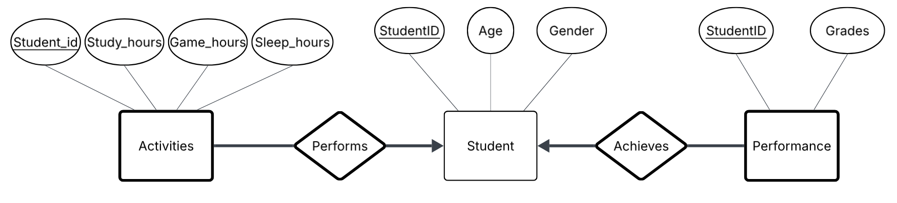

# E/R diagram

# Running DIS-project
 Assuming python 3 and PostgreSQL 18

 (1) run this code to install dependencies.
 >$ pip install -r requirements.txt

 (2) Go into the app.py file and insert your password in the database configuration
 
 (3) you must be inside the location of the data folder and then to initialize the database you must run this command.
 >$ psql -U postgres -f data_test.sql

If the above mentioned command does not work use this command below.
 >$ & "C:\Program Files\PostgreSQL\18\bin\psql.exe" -U postgres -d data_test -f data_test.sql

 (4) Now navigate to the main directory DIS-projekt and then run this command.
 >$ python app.py

 if the above mentioned command does not work use this command below.
 >$ py app.py